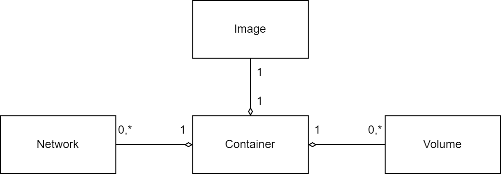

[Zurück](../README.md)

# 1 Dimensionen



## 1.1 Image
Befehle zur Verwaltung der lokalen Images. Images können nur gelöscht werden, wenn keine zugehörigen Container existieren.

### 1.1.1 Listen aller lokalen Images
```
docker image ls
```

### 1.1.2 Entfernen einen lokalen Image
```
docker image rm <ID oder Name>
```

### 1.1.2 Löschen aller lokalen Images zu den keine Container existieren
```
docker image prune
```

## 1.2 Container

### 1.2.1 Stadien

* **Nicht existent**
* Running
* Exited

### 1.2.2 Listen aller Container die ausgeführt werden
```
docker container ls
```

### 1.2.3 Listen aller Container die werden
```
docker container ls -a
```

### 1.2.4 Entfernen einen lokalen Image

Der zu stoppende Container muss vorher beendet sein.

```
docker container rm <ID oder Name>
```

### 1.2.4 Löschen aller nicht laufenden Container
```
docker image prune
```

## 1.3 Volume

### 1.3.1 auflisten aller Volumes

```
docker volume ls
```

## 1.4 Network

### 1.4.1 auflisten aller Networks

```
docker network ls
```